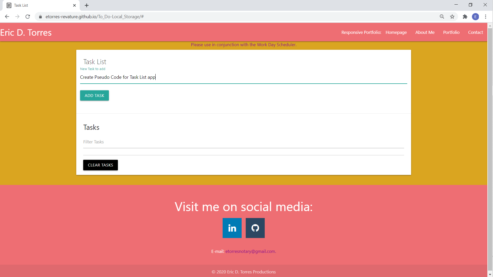
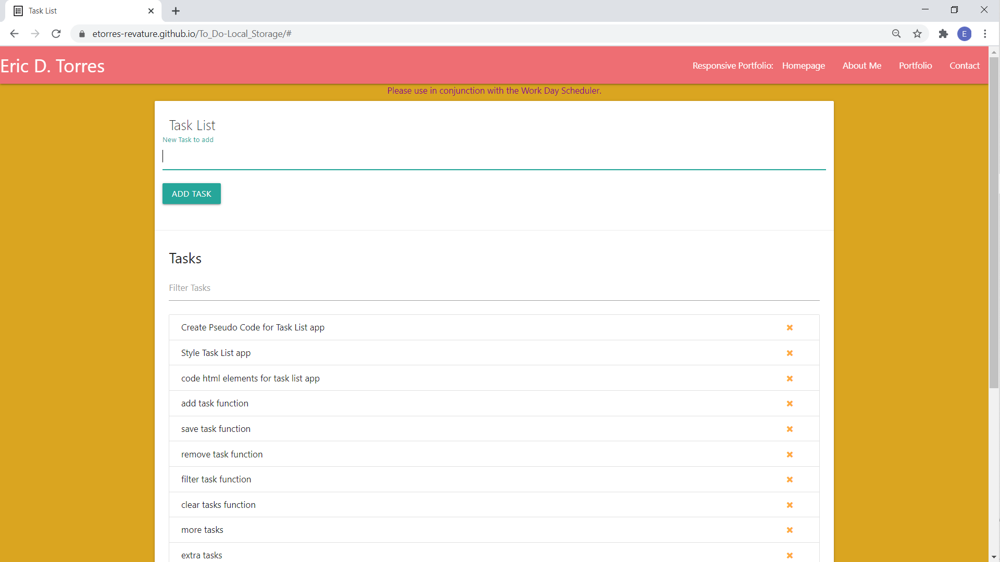
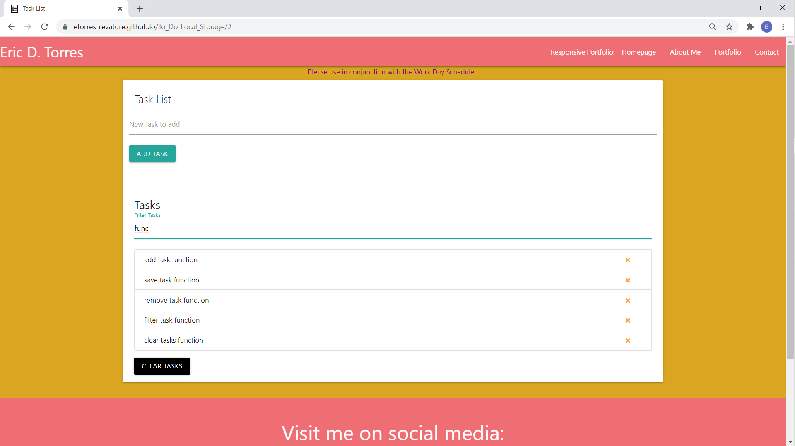
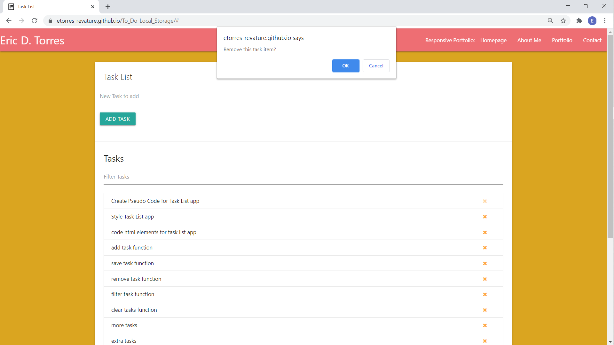
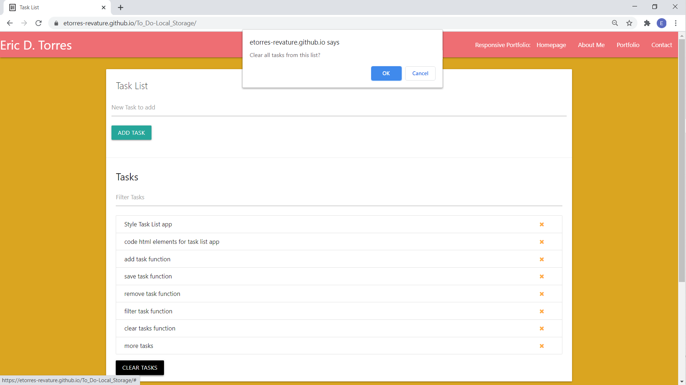

# :clipboard: [To_Do-Local_Storage](https://etorres-revature.github.io/To_Do-Local_Storage/) :clipboard:

The [Task List](https://etorres-revature.github.io/To_Do-Local_Storage/) app keeps track of to-do items.  You can enter new items.  Those items are statically displayed in a list, which can be filtered to find certain to-do items.  And, items can be deleted: etiher one-at-a-time or all-at-once.

## :file_folder: CRUD :file_folder: ##

The four basic functions of persistent storage are:

1. Create
1. Read
1. Update
1. Delete

Collectively, these are known as the **CRUD** functions and are the basic elements of any relational database. This app does not utilize a realtional database, but it does use the **CRUD** functions.

### CREATE 

The Task List app uses an input text box to capture tasks entered by the user.  Upon clicking the "ADD TASK" button the task is saved to local storage as a JSON string.  By using local storage the task can be persisted into memory, and will be available to the app until the local storage is emptied. 

### READ 

The Task List app uses local storage to persist, or "remember", the items contained therein.  Then the tasks can be taken from local storage and rendered on the page in the order they were entered.  In this way the tasks in the Task List will be on display and avaialbe to be read by the users of the Task List app. 

### UPDATE 

As the Task List grows, users can access the filter function to find specific tasks.  

Full update functionality coming to future versions of the Task List app.  

### DELETE 

As tasks are completed, they can be removed one-at-a-time with the "x" opposite the listed task.  The Task List app will send an alert to the screen asking if you are sure to remove this Task List item.  If confirmed by clicking the "OK" button, the item will be removed from the list and from local storage.

Tasks can also be cleared wholesale with the "CLEAR TASKS" button.  This button clears local storage and removes all items from the Task List.

For maximum efficiency, be sure to use the [Task List](https://etorres-revature.github.io/To_Do-Local_Storage/) in conjunciton with the [Work Day Scheduler](https://etorres-revature.github.io/Work_Day_Scheduler/) app.

### :computer: Technologies Used :computer:

#### :memo: HTML5 :memo:

**HTML5** is a markup language used for structuring and presenting content on the World Wide Web.  The goals are to improve the language with support for the latest multimedia and other new features; to keep the language both easily readable by humans and consistently understood by computers and devices; and to remain backward compatible to older software.  Many new symantic features are included.

*HTML5* content borrowed from <a target="_blank" rel="noopener noreferrer">[this page](https://en.wikipedia.org/wiki/HTML5).</a>

#### :art: CSS :art:

**Cascading Style Sheets (CSS)** is a stylesheet language used for describing the presentation of a document written in a markup language (such as HTML5).  CSS is designed to enable the separation of presentation and content; including layout, colors, and fonts.  This separation improves content accessibility to provide more flexibility and control in the specification of presentation characteristics, enabling multiple web pages to share formatting by specifying relevant CSS in a separate file, which reduces complexity and repetition in the structural content (HTML), as well as enabling the file to be cached to improve the page load speed between the pages that share the file and its formatting.

Separation of formating and content also makes it feasible to present the same markup page in different styles for different rendering methods, such as on-screen, in print, by voice, and on Braille-based tactile devices. 

*CSS* content borrowed from <a target="_blank" rel="noopener noreferrer">[this page](https://en.wikipedia.org/wiki/Cascading_Style_Sheets).</a>

#### :page_with_curl: MaterializeCSS :page_with_curl:

**MaterializeCSS** combines the classic principles of successful design along with innovation and technology. The goal is to develop a system of design that allows for a unified user experience across all their products on any platform.

Elements and components such as grids, typography, color, and imagery are not only visually pleasing, but also create a sense of hierarchy, meaning, and focus. 

*Materialize* content borrowed from <a target="_blank" rel="noopener noreferrer">[this page](https://materializecss.com/about.html).</a>

#### :sparkler: JavaScript :sparkler:

**JavaScript (JS)** is one of the core technologies of the World Wide Web (along with HTML and CSS). It enables interactive web pages and is an essential part of web applications.  JS is a multi-faceted, scripting language that provides versatility through Application Programming Interfaces (APIs) and Document Object Model (DOM) manipulation, among others.

*JavaScript* content borrowed from <a target="_blank" rel="noopener noreferrer">[this page](https://en.wikipedia.org/wiki/JavaScript).</a>

## Author :sunglasses:

Content and design created by :green_heart: Eric D. Torres :green_heart:.  

The author can be reached at etorresnotary@gmail.com. 

#### License

MIT License

Copyright (c) 2020 EricDTorres

Permission is hereby granted, free of charge, to any person obtaining a copy
of this software and associated documentation files (the "Software"), to deal
in the Software without restriction, including without limitation the rights
to use, copy, modify, merge, publish, distribute, sublicense, and/or sell
copies of the Software, and to permit persons to whom the Software is
furnished to do so, subject to the following conditions:

The above copyright notice and this permission notice shall be included in all
copies or substantial portions of the Software.

THE SOFTWARE IS PROVIDED "AS IS", WITHOUT WARRANTY OF ANY KIND, EXPRESS OR
IMPLIED, INCLUDING BUT NOT LIMITED TO THE WARRANTIES OF MERCHANTABILITY,
FITNESS FOR A PARTICULAR PURPOSE AND NONINFRINGEMENT. IN NO EVENT SHALL THE
AUTHORS OR COPYRIGHT HOLDERS BE LIABLE FOR ANY CLAIM, DAMAGES OR OTHER
LIABILITY, WHETHER IN AN ACTION OF CONTRACT, TORT OR OTHERWISE, ARISING FROM,
OUT OF OR IN CONNECTION WITH THE SOFTWARE OR THE USE OR OTHER DEALINGS IN THE
SOFTWARE.